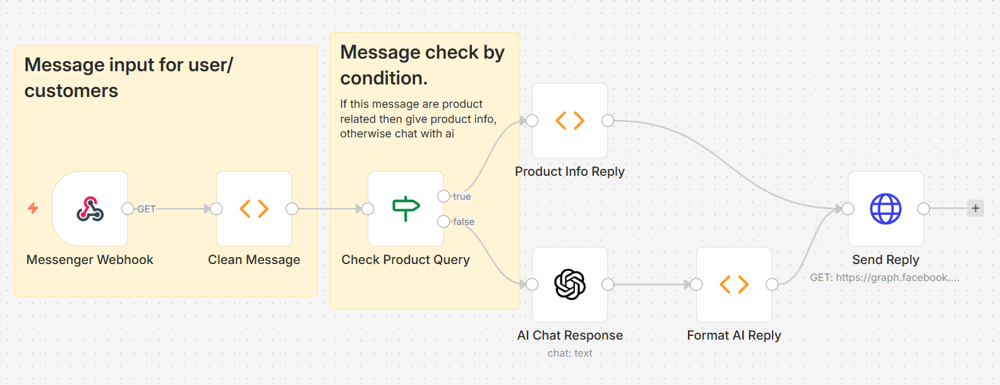

# 🤖 Messenger AI Automation Bot (n8n)

An AI-powered Facebook Messenger automation system built with n8n that handles customer queries, product details, pricing, and intelligent conversations.

---

## 📸 Workflow Preview



---

## 🚀 Features

- 💬 Automatic message reply system
- 📦 Product price & details response
- 🧠 AI-powered chatbot (OpenAI)
- 🔍 Keyword-based message detection
- ⚡ Real-time Messenger integration
- 🔒 Scalable automation workflow

---

## 🛠️ Tech Stack

- n8n (Workflow Automation)
- Facebook Messenger API
- OpenAI API (AI Chatbot)

---

## ⚙️ How It Works

1. User sends message on Messenger
2. Webhook receives message in n8n
3. System analyzes keywords:
   - "price" → sends product price
   - "product" → sends details
   - others → AI chatbot response
4. Sends reply automatically

---

## 📦 Installation & Setup

### 1. Install n8n
```bash
npm install n8n -g

```
---
### 2. Clone Repository
```bash
git clone https://github.com/your-username/messenger-ai-automation-bot.git
cd messenger-ai-automation-bot
```
## 3. Import Workflow
  -Open n8n
  -Click Import Workflow
  -Upload workflow.json
## 4. Setup Credentials
  -Facebook Page Access Token
  -OpenAI API Key
